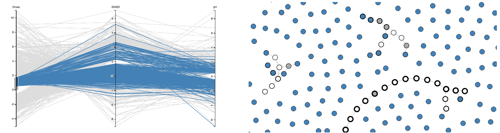

QuantNet
========

A Web tool to go from **Quant**itative values to biological **Net**works.

You need to have Python installed on your computer with the following dependencies:

  * networkx
  * tornado
  * ujson
  * pandas

You need also to have the tool [bower](http://bower.io) installed on your computer.

To install the Web server dependencies, from the directory website/static, type:

    bower install

This project contains sample data to quickly see how the tool is working. First you need to initialize these data. To do so type from the QuantNet directory;

    ./scripts/init.py

Once done (this can take a while), type:

    ./website/server.py

Now open your browser at [http://localhost:8080](http://localhost:8080) and enjoy!
